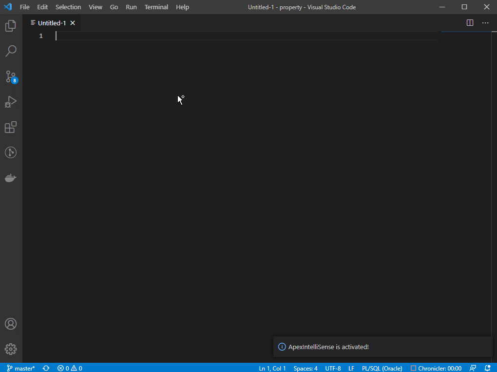

# ApexIntelliSense README

AutoCompletion aka IntelliSense for APEX parsing schemas, inclusive all granted packages, procedures and functions. 
Access to APEX page items.

## Demo

## Requirements
- You must activate the extension (`Ctrl+Shift+P` -> `ApexIntelliSense: Activate`)
- You must connect to the Development Environment at least one time to build the cache
- You must download and install the OracleInstantClient 
- You must configure the Plugin under Settings->ApexIntelliSense

## Extension Settings

This extension contributes the following settings:

* `ApexIntelliSense.Connection`: connection string to database
* `ApexIntelliSense.Username`: schema name
* `ApexIntelliSense.Oracle Instant Client Path`: Path to your Oracle Instant Client
* `ApexIntelliSense.PublicPackages`: Comma (",")-seperated list of packages that are granted to public and exposed via public synonym 
* `ApexIntelliSense.LoadApexPacakges`: Wether the APEX_* Packages should be loaded (see 'Feature->Caching' in this readme)
* `ApexIntelliSense.LoadObjectsOnActivate`: Wether DB Objects should be loaded when extension is activated, otherwise it tries to load objects from cache
* `ApexIntelliSense.ApexCacheFile`: Load a central apex cache file to the extension instead of pulling it again (performance reasons)

## Features

### Caching
When the plugin is activated it will create a directory .ais where caches are stored (only when you activate the options 'LoadApexPacakges' and/or 'LoadObjectsOnActivate').
There are two types of caches:

- User Object Cache (cache.yaml)
- APEX Object Cache (apex.yaml)

Caches can be updated via the 'ApexIntelliSense: Update Cache' command

#### User Object Cache

The User Object Cache will contain the following Objects:

- APEX Page Items
- All executable Packages/Procedures/Functions incl. of their arguments and return types

It is recommended to let this option be activated.
#### APEX Object Cache

The APEX Object Cache contains all APEX_* packages with all of their methods (and of course arguments and return types) regardless of them to be part of the documentation or not. The process of loading the APEX packages is taking a while, therefor it is recommended to save a central apex cache and use the 'ApexCacheFile'-Setting.

## Known Issues

|Description|Status|Version|
|-----------|------|-------|
|When there is a package with the same name as a granted package the methods will be merged| solved | 2.2.7|
|After Update on 2.2.7 completionlist is broken| solved | 2.2.8|

## Release Notes

### 2.2.8
- solved issues
### 2.2.7
- solved issue merging methods on equal package names
- nicer argument-types
- When update to > 2.2.7 please reload all caches there are major changes in the File Structures so this is mandatory, otherwise the plugin will not work properly
### 2.2.5
- solved issue with apex object
- more informative package loading
### 2.2.1-4
- minor changes

### 2.2.0
- autocompletion enhancements

### 2.1.0
- new Setting: ApexCacheFilePath

### 2.0.2
- Connection Bug
- Performance!!

### 2.0.1
- Additional APEX Cache
- Settings Bug

### 2.0.0
- Caching
- nicer CompletionItemList with documentation

### 1.0.2
Integrated Setting, PublicPackages:
Comma (",")-seperated list of packages that are granted to public and exposed via public synonym.
APEX Application Items

### 1.0.0
Initial release of ApexIntelliSense

### 1.0.1
Fixed Bug wrong arguments in method

**Enjoy!**
